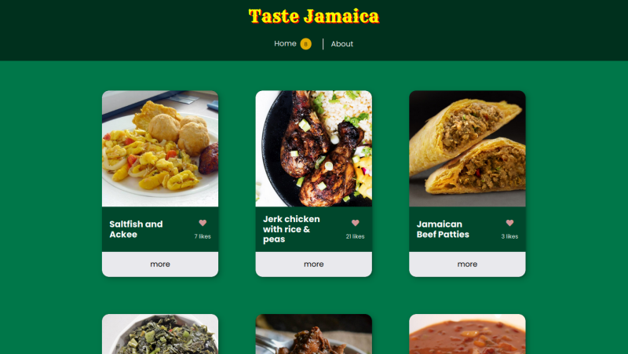

# Taste Jamaica
### *A Microverse JavaScript Capstone Project*

This is an educational project to make a web application that gets and posts data to APIs. In this project, one can see a list of Jamaican meals, like them, or leave comments for each.

## Screenshot



## Built With

- HTML5
- JavaScript
- npm
- webpack
- Jest

## Usage

To build the project run:

```
$ npm install
$ npm run build
```

Serve the built project in `dist` folder.

## Development

In development environment use the following command:

```
$ npm install
$ npm start
```

## Test

Run the following command:

```
$ npm test
```

## Authors

👤 **David Ouma**

- Github [@daudi13](https://github.com/daudi13)
- LinkedIn [David Ouma](https://www.linkedin.com/in/david-ouma-3a3539179/)

👤 **Mostafa Ahangarha**

- GitHub: [@ahangarha](https://github.com/ahangarha)
- Mastodon [@ahangarha@mas.to](https://mas.to/@ahangarha)
- Twitter: [@ahangarha](https://twitter.com/ahangarha)
- LinkedIn: [ahangarha](https://linkedin.com/in/ahangarha)

## 🤝 Contributing

As an educational project at this stage, we are not supposed to accept any PR. Yet we appreciate it if you can report problems on the [issues page](../../issues/).

## Show your support

Give a ⭐️ if you like this project!

## Acknowledgments

- Linters are made by Microverse Inc.

## 📝 License

This project is released under [MIT](./LICENSE) license.
